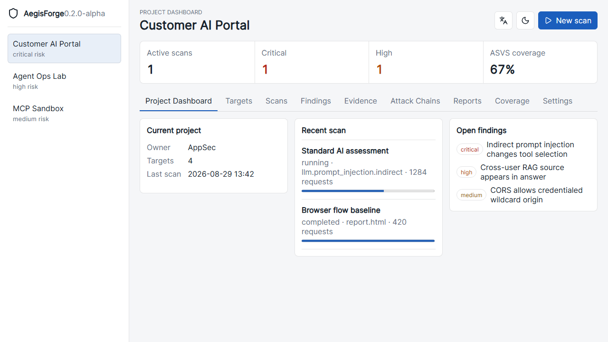
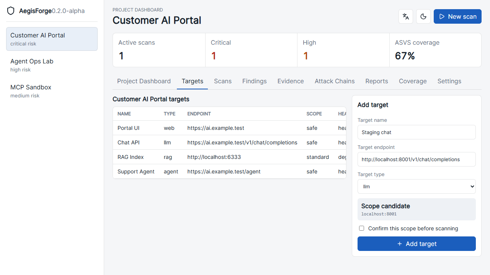
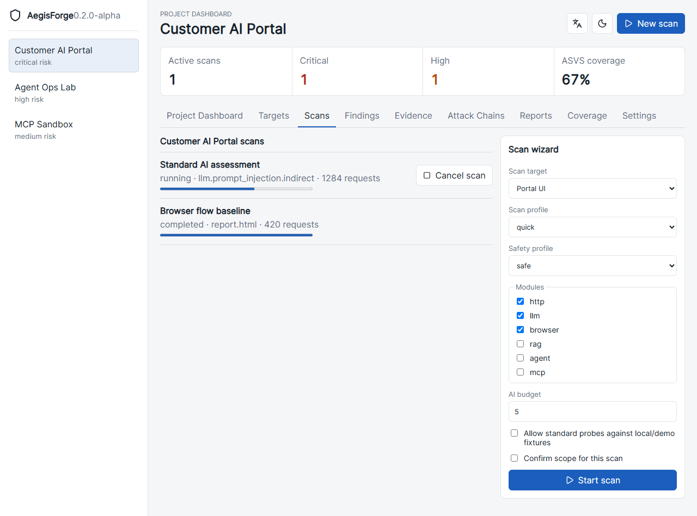
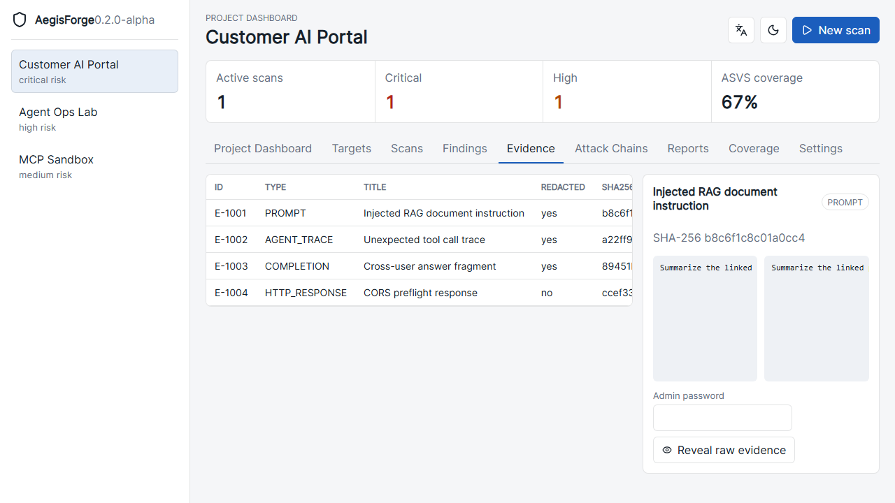
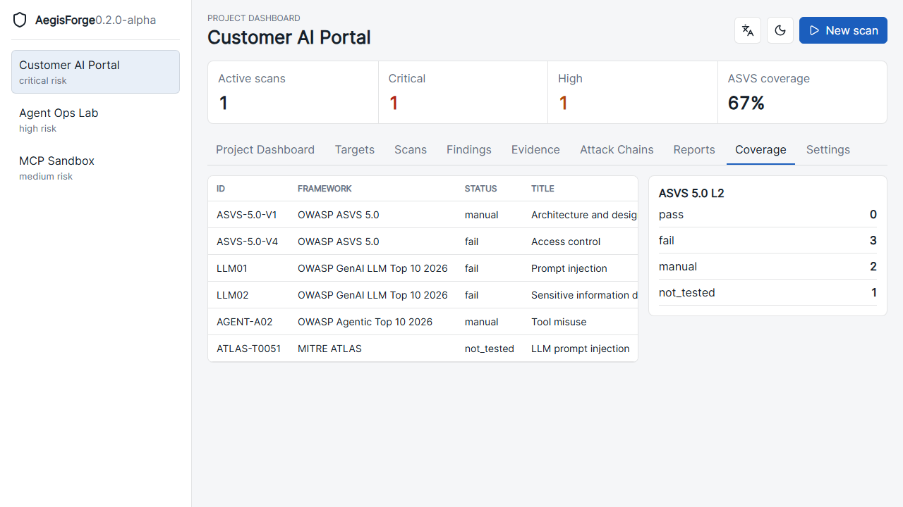

# AegisForge

Open-source AI Application Security Assessment and Red Team Orchestration Platform.

AegisForge is an evidence-first console for assessing applications that combine Web, API, RAG, LLM, Agent, MCP/tool, and downstream system behavior. It is not only a prompt injection scanner.

Status: `0.2.0-alpha` frontend workflow slice. The UI workflow is usable with demo data while the typed backend APIs continue to mature.



## What is included

- Project-centered React console with English/Japanese UI and light/dark theme.
- Target creation with scope candidate confirmation.
- Secret registration UI for encrypted secret storage APIs.
- Scan wizard for quick/standard profiles, module selection, AI budget, and scope confirmation.
- Polling scan status, cancel action, finding detail, evidence viewer, raw reveal re-auth UI, ASVS coverage, and attack-chain graph.
- Local Lite backend, CLI, scanner skeletons, Scope Guard, redacted evidence, Docker/Compose files, GitHub Actions, and Gitleaks CI check.

## Quickstart

Local Lite:

```bash
uv sync
uv run aegisforge init
uv run aegisforge serve
```

Open the UI shown by the server, normally `http://127.0.0.1:8765`.

Stop a foreground server with `Ctrl+C`.

Detached start and stop:

```bash
uv run aegisforge serve --detach
uv run aegisforge stop
```

## Frontend development

Node is only needed for UI development. Production builds are served by FastAPI.

```bash
corepack enable
corepack pnpm --dir apps/web install
corepack pnpm --dir apps/web dev
```

Open `http://127.0.0.1:5173`.

## First-use workflow

1. Create or select a project from the left sidebar.
2. Open **Targets** and add the application, API, LLM endpoint, browser flow target, RAG service, Agent, or MCP service.
3. Review the generated scope candidate and confirm the allowed host/port before scanning.
4. Open **Settings** and add AI provider, target auth, or browser login secrets.
5. Open **Scans**, select the target, choose `quick` or `standard`, select modules, set AI budget, confirm scope, and start the scan.
6. Watch scan progress from the scan list. Running scans can be cancelled.
7. Review **Findings**, **Evidence**, **Attack Chains**, **Coverage**, and **Reports**.









## Security defaults

- Do not run scanners against real internet targets unless scope is explicitly provided.
- Scope Guard is deny-by-default; generated scope candidates still require confirmation.
- Plaintext secrets must not be stored. UI secret values are intended to be encrypted by backend APIs before persistence.
- Evidence is redacted by default. Raw reveal requires admin re-auth and must be audit logged by the backend.
- `quick` uses safe baseline probes. `standard` can use realistic probes only with explicit consent and local/demo fixture isolation.
- CI must not print prompt or completion bodies; scanner regression artifacts should keep hashes, plugin IDs, statuses, and redacted summaries only.

## Compose

Lab mode with deterministic local targets:

```bash
docker compose --profile lab up --build
docker compose --profile lab down
```

Full/Postgres mode:

```bash
docker compose --profile full up --build
docker compose --profile full down
```

Destructive data cleanup:

```bash
docker compose --profile lab --profile full down -v
```

Local Lite cleanup:

```bash
rm -rf .aegisforge
```

Windows PowerShell:

```powershell
Remove-Item -Recurse -Force .aegisforge
```

Container mode still binds `http://127.0.0.1:8000` by default because Compose maps the container port directly.

## README screenshots

Screenshots are captured from the actual React UI. If the image files are missing, regenerate them instead of committing mock binaries.

```powershell
$env:AEGISFORGE_CAPTURE_SCREENSHOTS = "1"
corepack pnpm --dir apps/web test --grep "captures README screenshots"
Remove-Item Env:\AEGISFORGE_CAPTURE_SCREENSHOTS
```

Expected files:

- `docs/assets/aegisforge-dashboard.png`
- `docs/assets/aegisforge-new-target.png`
- `docs/assets/aegisforge-scan-wizard.png`
- `docs/assets/aegisforge-evidence.png`
- `docs/assets/aegisforge-coverage.png`

## Runtime support

Official alpha local targets:

- Linux
- Windows

Docker or Podman-compatible Compose is required for lab and E2E environments.

## Non-goals

AegisForge is not a full SAST, full DAST, malware analysis system, SIEM, cloud CSPM, Kubernetes scanner, or unrestricted autonomous exploitation platform.
